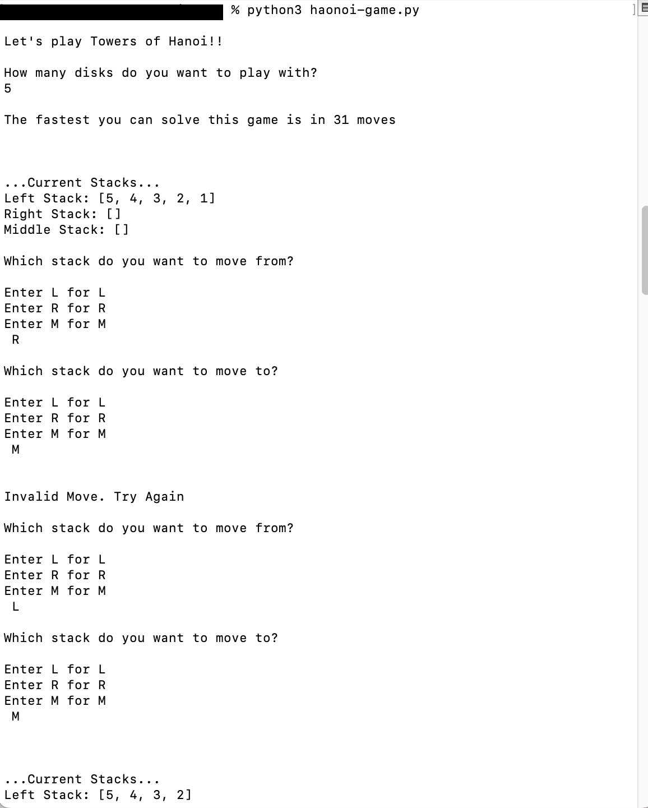

# Hanoi Game

This is a Python implementation of the classic Tower of Hanoi puzzle game. The objective of the game is to move all the disks from the leftmost peg to the rightmost peg, following these rules:

1. Only one disk can be moved at a time.
2. Each move consists of taking the top disk from one stack and placing it onto another stack.
3. No disk may be placed on top of a smaller disk.

## How to Play

1. Clone the repository to your local machine using the following command:
git clone https://github.com/aleenababy/hanoi-game.git

2. Navigate to the project directory:
      cd hanoi-game
3. Run the game using Python:
      python hanoi_game.py

4. Follow the prompts to input the number of disks you want to play with and start the game.

## Features

- Interactive command-line interface (CLI) for playing the game.
- Recursive algorithm implementation for solving the Tower of Hanoi puzzle efficiently.

## Screenshots

## License

This project is licensed under the [MIT License](LICENSE).

## Contributing

Contributions are welcome! Feel free to open an issue or submit a pull request.

## Acknowledgements

- Inspired by the classic Tower of Hanoi puzzle.
- Special thanks to [Python.org](https://www.python.org/) for the Python programming language.

## Contact

For questions or inquiries, please contact [aleenababy](mailto:aleenababy839@gmail.com).

